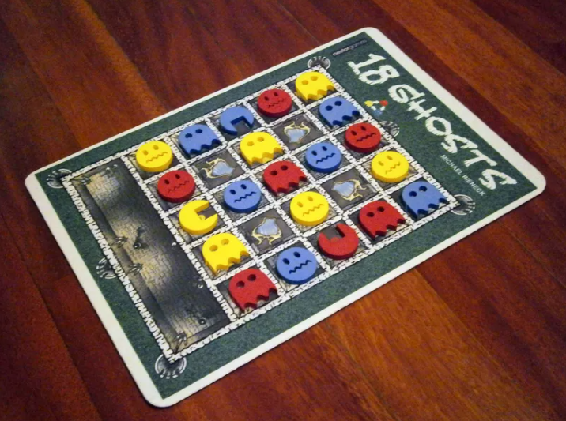

# IA Project 1 - 18 Ghosts



---

## Compilation and Execution of the Program

This game was programed in Python. If you don't already have Python installed, you can proceed as follows:  

**Windows:**
- Download the Python installer from the official Python website (https://www.python.org/downloads/windows/)
- Run the installer and follow the on-screen instructions
- During the installation process, make sure to select the option to add Python to the PATH environment variable

**Linux:**
- Open a terminal window
- Use your system's package manager to install Python; for example, on Ubuntu or Debian-based systems, run the following command in the terminal:
    ```
    sudo apt-get install python3
    ```
- Once Python is installed, you can start the Python interpreter in the console by running the "python" command

**macOS:**
- Open a Terminal window
- Install Homebrew (if you don't already have it) by running the following command in the Terminal:
    ```
    /bin/bash -c "$(curl -fsSL https://raw.githubusercontent.com/Homebrew/install/HEAD/install.sh)"
    ```
- Install Python 3 by running the following command in the Terminal:
    ```
    brew install python
    ```

Now, you'll need to install some libraries (pygame and numpy) by writing these commands in the console:
```
// for python3
pip3 install pygame
pip3 install numpy

// for python
pip install pygame
pip install numpy
```

Once you've followed all these instructions you are ready to run the program. Simply type in the console:
```
// for python3
python3 main.py

// for python
python main.py
```
This will execute the program and now you can play 18 Ghosts.  
All actions in the interface are performed using the left mouse button (clicks), except for the ESC key which makes you leave the game. 

---

## How to play

Read the game instructions here: [[Game Rules](docs/18GHOSTS_EN_r1.pdf)]  

Additional notes:
- To respawn one of your ghosts, instead the ghost will be placed in the tile of the corresponding color furthest from the portal (of the same color) assuming the tyle is empty; otherwise, the action cannot take place
- A player loses if there are no possible moves (including respawns) left at the moment or the opponent has one ghost of each color outside the castle

---

**Project done by:**
- Diogo Silva (up202004288)
- Henrique Silva (up202007242)
- Tiago Branquinho (up202005567)

---
